# Virtual Gym Assistance using Deep Learning

*By: Rogier van Tienen, Rayan Salmi & Ricardo Steen*

*From: Delft University of Technology*

*Date: 7th of April 2026*

*Group: 1 (The three R's)*

---

### TODO; figures

Figures:

- dataset example frames
- GIF with demo
- screenshot of UI?

## Introduction

In the last years, the popularity of the gym has been increasing. Most of these gyms have employees working in the gym to help people with exercises, but there are also a large number of gyms where no employee is present. This can cause difficulties for people who have just started to work out and have questions about certain gym exercises they are performing. To come with a solution, this blog proposes a virtual gym assistant. With new computer vision techniques like more accurate pose estimation methods, it becomes easier to track human movement. The proposed virtual gym assistant uses these techniques to classify the type of exercise, count the repetitions, and give feedback on how the exercise is performed and whether the form was correct. 

In this blog, we first discuss related work to get an idea of the models that are currently used for the aforementioned computer vision tasks. Next, we introduce the dataset used in this study and explain the motivation behind its selection. Then we discuss the methods used for exercise classification, repetition counting, and form feedback. Finally, we present several experiments conducted on both test-data and unseen self-recorded exercise videos to evaluate the performance of the video.
<!-- 
## Problem definition
TODO: include this in the introduction chapter

The problem can be divided into multiple sub-problems:

1. Pose Estimation: skeletonization of human
2. Exercise classification
3. Repetitive action counting: video-level or pose-level (= skeleton-level)
4. Form analysis/feedback -->

## Related Work
Our main inspiration for this project is the research done by Riccio[14]. In his paper, Riccio showed a computer vision pipeline that was able to classify exercises and count repetitions. To improve upon Riccio's work, we decided to include form analysis and feedback. And for further literature review, we looked at recent advancements in computer vision driving virtual gym assistants. These advancements can be categorized into pose estimation, exercise classification, repetitive action counting (RAC), and form analysis.

**Pose Estimation:** 
To succesfully analyze human movement, accurate and fast pose estimation is essential. Early breakthroughs in this domain were made by models like OpenPose and AlphaPose, which introduced robust multi-person pose estimation using part affinity fields and top-down bounding box detection [3][6]. While highly accurate, these models can be computationally heavy. For a real-time gym assistant, low-latency processing on consumer hardware is crucial. This requirement leads to MediaPipe, particularly with its modern BlazePose model [13][2]. By utilizing a lightweight neural network architecture, BlazePose achieves real-time 3D skeleton tracking on mobile and edge devices, forming an ideal foundation for a virtual gym assistant.

**Exercise Classification:**
Once a skeleton is extracted, the next step is determining which exercise the user is performing. Recent research has shifted heavily towards deep learning on skeletal data. Graph Convolutional Neural Networks (GCNs) became a well-known technique, as they naturally model the human skeleton as a spatial-temporal graph of joints and bones [15]. Building upon this, architectures like Graph Skeleton Transformer Networks (GSTN) have emerged, combining the structural awareness of graphs with the sequence-modeling power of Transformers, giving state-of-the-art accuracy with low latency for real-time classification of fitness movements[8].

**Repetitive Action Counting (RAC):**
Counting repetitions is a core feature of any gym assistant. Initial methods utilized simple State Machines, manually defining the start and end conditions of a repetition based on specific joint angles. However, these rule-based approaches lack robustness across different body types and camera angles. This led to data-driven methods such as RepNet, which learns period length directly from video frames, and transformer-based models like TransRAC and SSTRAC, which capture long-range temporal dependencies in repetitive actions [5][7][12]. Recent approaches emphasize efficiency and spatial-temporal skeleton dynamics; for instance, SPKDB-net[1] leverages salient-part pose keypoints for robust counting, while MSF-Mamba is considered state-of-the-art for RAC, as it combines linear state-space models with a motion-aware state fusion mechanism to detect subtle temporal patterns and repetitions efficiently and in real-time [11].

**Form Analysis and Feedback:**
The most complex capability of a gym assistant is providing corrective feedback. Early systems relied heavily on logic-based algorithms, where an alert is triggered if a joint angle strays beyond a predefined limit [4]. Modern approaches treat incorrect form as a deviation from a learned baseline, employing anomaly detection algorithms to identify mistakes without needing explicitly labeled "bad form" data [9][10]. Furthermore, highly efficient methods like MSF-Mamba are actively being extended not just for counting, but to provide rich feedback, bridging the gap between simply tracking a workout and actively coaching the user in real-time.

## Data

### Dataset
The dataset that was used for this project was the Pen action dataset. This dataset offers a variety of movements from different sports. This dataset also includes different gym exercises like squats and pushups. A convenient aspect from this dataset is that the dataset tracks the joint positions constantly. This aspect is important for training the model, because joint positions give information about the state of the exercise and whether someone has a good form. Despite that this dataset has convenient aspects, it also has a downside. All exercises from the Penn action dataset only have one rep. For rep counting this is not ideal, because that way the system can think that all exercises only have one rep. With data augmentation this problem is resolved, while also enlarging the dataset.
### Data augmentation
The Penn Action dataset contains relatively little data per exercise, as it includes only 2,326 videos spread across fifteen different exercises. Further the data is only limited to exercises with one rep, as discussed earlier. To expand the data to more reps, some of the videos where looped to obtain exercises with different amounts of reps. The number of reps where set to be random to obtain different rep ranges. To expand the data even further, multiple augmentations, including scaling, translating, and flipping, where applied to the data. The augmentations caused the dataset to grow with 96%, meaning that the model was trained on almost twice as much data as the original dataset.

## Methodology

### Spatial-Temporal Graph Convolutional Network

#### What Problem Does This Model Solve?

When a computer tries to understand what a human is doing, for example walking, waving or jumping, it needs a way to interpret movement. The most obvious approach might be to analyze video pixels directly, but this wastes computational effort on all kinds of visual noise that have nothing to do with the action itself. A smarter approach is to work with pose data: a representation of the human body as a set of joint positions tracked over time. Given a sequence of frames where each frame contains the 2D or 3D coordinates of joints like the head, elbows, wrists, hips and knees, the question becomes how to classify what action is being performed. The Spatial-Temporal Graph Convolutional Network (ST-GCN) was designed precisely to answer this question.

#### The Body as a Graph

The main idea of the ST-GCN is that the human body is not a grid, it is a graph. A graph is a mathematical structure made up of nodes connected by edges, and it turns out this is the most natural way to represent a skeleton. In our implementation, the graph consists of 13 nodes corresponding to the major joints: the head, shoulders, elbows, wrists, hips, knees, and ankles. The edges represent connections between joints (bones), such as the link between the left shoulder and left elbow, or between the left hip and the left knee. There is also a connection between the left and right hip, representing the pelvis as a shared anchor. Because body joints relate to each other through these physical connections, and not through their proximity on a flat grid, a graph structure captures the real relationships in a way that a regular convolutional neural network operating on a pixel grid simply cannot do.

#### Spatial Partitioning

In our implementation we structure the graph spatially, rather than treating all connections equally, the model divides each joint’s neighborhood into three distinct subsets based on the hop distance from a center node. In our case, the center is the left hip, chosen because it sits near the body’s center of mass. For any given joint, its neighbors can be joints at the same distance from the center (for example, the left and right knees are both two hops away), joints closer to the center (the hip is closer to the center than the knee), or joints further from the center (the ankle is further from the center than the knee). This three-way split, called the spatial partitioning strategy, means the model has three separate learnable transformation matrices, one for each direction of information flow. This allows the network to learn how information propagates toward the body’ core versus away from it, which turns out to be physically meaningful: the motion of the hands depends on the arms in a different way than the arms depend on the torso. Furthermore, every edge in the adjacency matrix is also paired with a learnable importance weight. These weights are initialized to one and updated during training, allowing the model to discover which joint connections are most informative for distinguishing between different actions, a push-up and squat in our case. For a push-up it might learn to look at how the joints in the arms move and for a squat it might look more at the joints in the legs.

#### Graph Convolution

The spatial graph convolution module, called unit_gcn, takes a batch of skeleton frames and propagates information across joints. For each of the three spatial subsets, it applies a learned linear projection to the joint features and then multiplies the result by the corresponding weighted adjacency matrix. The output is the sum of contributions from all three subsets, passed through batch normalization and a ReLU activation. Furthermore, a residual connections is added, the input is projected (if necessary to match channel dimensions) and added back to the output. This skip connection comes from the ResNet architecture and serves two purposes: it prevents the vanishing gradient problem in deep networks, and it ensures that each layer refines rather than replaces the representation, preserving useful information from earlier in the network.

#### Temporal Convolution

Understanding a single frame of skeleton data tells you a pose but not an action. To recognize actions, the model must also understand how poses change over time. This is handled by the temporal convolution module, called the unit_tcn, which is a standard 2D convolution applied along the time axis. It uses a kernel of size 9 in the temporal dimension and 1 in the joint dimension, meaning it looks at a window of 9 consecutive frames for each joint independently, learning patterns like the rhythm of a push-up or squat cycle.

#### Stacking Layers

The full model has 4 ST-GCN blocks in sequence. The first two blocks operate at full temporal resolution and expand the channel depth from 3 to 32 channels, allowing the network to build up an internal representation of joint relationships and local motion. The third block introduces a stride of 2, halving the time dimension and doubling the channels to 64, the model starts to see broader motion patterns. By this point in the network, each feature vector encodes high-level, abstract information about how the whole body moved over the course of the clip. This progressive deepening of channels alongside temporal compression copies the design of standard image recognition networks, but adapted for the graph-structure of the data.

In addition to this configuration, we experimented with multiple model sizes to balance performance and efficiency. A larger variant with 7 ST-GCN blocks was explored, but it proved to be unnecessary for our task, adding complexity without meaningful performance gains. A medium-sized model with 4 blocks was ultimately selected as it provided a strong balance between accuracy and computational cost. We also designed a smaller 3-block variant, which can serve as a lightweight alternative in more constrained environments. However, in practice, the 4-block model was already efficient enough for real-time usage, making it our preferred choice.

*Figure 1: Pipeline of the medium size ST-GCN model for exercise classification. Input skeleton sequences are normalised via batch normalisation before passing through four backbone blocks, each containing a spatial graph convolution (GCN) and a temporal convolution (TCN). Block 3 uses a stride of 2 to halve the temporal resolution. The resulting features are collapsed via global average pooling and passed to a linear classifier to produce the final action prediction.*

### Exercise Classification

After the layers, the model collapses the remaining spatial and temporal dimensions by taking an average across all joints and all remaining time steps. This produces a single n-dimensional vector for each sample in the batch. A single linear layer then maps this vector to the number of action classes, producing logits for each possible action. During training, these logits are passed through a cross-entropy loss function and the entire network is trained end-to-end via backpropagation, learning joint relationships, motion patterns, and combining these into action predictions.

### Repetition Counting
We explored rep counting through phase prediction using two different approaches. The first approach relied on simple heuristic logic based on joint angles: by monitoring key angles during movement, we defined thresholds that indicate transitions between phases (e.g., “up” and “down”). Each time the angles crossed these thresholds in sequence, the system progressed to the next phase, enabling straightforward rep counting. In addition to this, we developed a learning-based approach by extending the exercise classification model with an additional output head that predicts the movement phase as a continuous value between 0 and 1, formulated as a regression problem. This allowed us to interpret phase transitions more flexible, for example values below 0.4 correspond to the “down” phase, while values above 0.6 indicate the “up” phase. By tracking these transitions over time, we were also able to count repetitions using the model’s predictions.

### Form analysis
For the form analysis it is more difficult to make a data driven model. Most of the data present in gym exercise data sets only consist out of good performed exercises. This is why a rule-based form analysis is chosen. With a rule-based approach it is possible to set some thresholds for whether a good form is achieved, or that some aspects need to be improved. In this study both squads and pushups are used for form analysis. One of the most important criteria in both exercises, is that the movement is deep enough.
The approach to finding the deepness from the exercise was almost identical for both exercises. First the model checks whether a rep was made, and after that the rule base system analyses whether this rep was deep enough. For the pushup, the most important joints where the shoulders and elbows, where for squats these are the hip and knee joints. For the pushup, the moment when the shoulder is at the same height as the elbow a good rep is achieved. For the squat this is when the hip is at the same height as the knee.
For both exercises also the form of the back is analyzed. For pushups it is important to have a straight back for the whole movement. To keep track on this, a straight line was drawn from the knee position to shoulder position. If the hip was too far from this line a threshold was exceeded, which resulted in a hollow or rounded back counter going up. For the rules it is important to normalize the threshold in this specific analyzing task. For people that are longer, the threshold needs to be higher. For the squad it is important to not lean too much forward when performing. To keep track of this, the shoulders and feet should both be on the same vertical line. When this distance is too large, the person leans too much forward. Also, in this analysis, normalization is very important.

## Results / Experiments
### Experiments
To test the model on robustness multiple experiments were conducted with video’s that were not in the dataset. These videos were self-created and included both squats and pushup of different rep ranges and were filmed from different angles. To make variety in test data, different locations were tested, with three participants in total. The test data consisted out of 20 video’s for pushups and 20 video’s for squats. Each video was validated separately with an accuracy for exercise prediction and an absolute error for rep counting, these metrics where automatically conducted by the application. The validation per exercise was done to also obtain visual feedback from each video. The visualization is also obtained by the application, this visualization shows the video with the joint positions that were recorded including the rep count and exercise prediction. The total result is the average classification accuracy and average absolute repetition error across push-ups, squats, and all exercises combined.

As an extension of the experiments, exercise form was also analyzed. Consisting of the amount of shallow reps and the actual form. The amount of shallow reps is computed on the same way as the total amount of reps, the only difference is that a threshold is set for the deepness of the exercise. The form was obtained in the same way for both the heuristic-based and learning-based approaches. Differences arise because the analysis depends on the exercise phase and predicted exercise, which vary between the approaches. Receiving results for the form analysis is harder to achieve than with the exercise prediction and rep count. The form analysis checks every frame whether a good form is achieved or whether the form is incorrect. Labeling each frame will take a lot of time, that is why an other approach is chosen. For this experiment, the labels include the number of correct repetitions, as well as the number of repetitions performed with specific form deviations (hollow back, rounded back, or forward lean).For each form type, the number of frames in which it occurs is counted and summed over the entire video. These counts are then converted into fractions representing the proportion of each form type. Each fraction is multiplied by the total number of actual repetitions to estimate the number of repetitions per form type. These estimates are then compared to the labeled counts, and the absolute error is computed for each form type.

### results
The results for exercise classification and absolute rep count error are shown in the tables below. Overall the learning based approach scores best with a higher accuracy for exercise prediction and a lower absolute rep count error. The primary challenge for the heuristic-based approach was camera placement. Additional factors that influenced model performance for both models included lighting conditions, extremely bad posture, outside frame joint positioning and abrupt video endings, where recordings stopped immediately after the final repetition.
#### Heuristic-based

| Exercise  | Mean accuracy exercise prediction | Mean absolute error reps |
|----------|------------------------------|---------------------|
| Pushup   | 0.7315                       | 1.0500              |
| Squat    | 1.0000                       | 3.0000              |
| Combined | 0.8658                       | 2.0250              |

#### Learning-based

| Exercise  | Mean accuracy exercise prediction | Mean absolute error reps |
|----------|------------------------------|---------------------|
| Pushup   | 1.0000                       | 0.9000              |
| Squat    | 0.9251                       | 0.8000              |
| Combined | 0.9625                       | 0.8500              |

The results from the form analysis is are shown below. One of the most remarkable findings is the great differences between the pushup form from the heuristic-based and the learning-based approaches. Absolute errors are much higher for the heuristic-based approach. This could be a result from poor exercise classification for pushups for the heuristic based approach. In squats the difference of mean absolute error is lower. 
#### Pushup: Absolute Error per Form Type

| Method           | Mean absolute error shallow rep | Mean absolute error good form | Mean absolute error rounded back | Mean absolute error hollow back |
|------------------|----------------------------|--------------------------|------------------------------|----------------------------|
| Heuristic-based  | 1.5000                     | 2.5658                   | 0.7938                       | 1.3645                     |
| Learning-based   | 0.8500                     | 0.5580                   | 0.3126                       | 0.2530                     |

#### Squat: Absolute Error per Form Type

| Method           | Mean absolute error shallow rep | Mean absolute error good form | Mean absolute error forward lean |
|------------------|----------------------------|--------------------------|------------------------------|
| Heuristic-based  | 0.4500                     | 0.2643                   | 0.2643                       |
| Learning-based   | 1.5500                     | 0.3124                   | 0.1282                       |

## References

1. Jinying Wu, Jun Li, Qiming Li, SPKDB-Net: A Salient-Part Pose Keypoints-Based Dual-Branch Network for repetitive action counting, Computer Vision and Image Understanding, Volume 259, 2025, 104434, ISSN 1077-3142, https://doi.org/10.1016/j.cviu.2025.104434.

2. Bazarevsky, V., Grishchenko, I., Raveendran, K., Zhu, T., Zhang, F., & Grundmann, M. (2020, 17 juni). BlazePose: On-device Real-time Body Pose tracking. arXiv.org. https://arxiv.org/abs/2006.10204 

3. Cao, Z., Hidalgo, G., Simon, T., Wei, S., & Sheikh, Y. (2019). OpenPose: Realtime Multi-Person 2D pose Estimation using part affinity fields. IEEE Transactions On Pattern Analysis And Machine Intelligence, 43(1), 172–186. https://doi.org/10.1109/tpami.2019.2929257 

4. Chen, S., & Yang, R. R. (2020, 21 juni). Pose Trainer: Correcting Exercise Posture using Pose Estimation. arXiv.org. https://arxiv.org/abs/2006.11718 

5. Dwibedi, D., Aytar, Y., Tompson, J., Sermanet, P., & Zisserman, A. (2020). Counting Out Time: Class Agnostic Video Repetition Counting in the Wild. IEEE/CVF Conference On Computer Vision And Pattern Recognition (CVPR), 10384–10393. https://doi.org/10.1109/cvpr42600.2020.01040 

6. Fang, H., Li, J., Tang, H., Xu, C., Zhu, H., Xiu, Y., Li, Y., & Lu, C. (2022). AlphaPose: Whole-Body Regional Multi-Person Pose Estimation and Tracking in Real-Time. IEEE Transactions On Pattern Analysis And Machine Intelligence, 45(6), 7157–7173. https://doi.org/10.1109/tpami.2022.3222784 

7. Hu, H., Dong, S., Zhao, Y., Lian, D., Li, Z., & Gao, S. (2022). TransRAC: Encoding Multi-scale Temporal Correlation with Transformers for Repetitive Action Counting. 2022 IEEE/CVF Conference On Computer Vision And Pattern Recognition (CVPR), 18991–19000. https://doi.org/10.1109/cvpr52688.2022.01843 

8. Jiang, Y., Sun, Z., Yu, S., Wang, S., & Song, Y. (2022). A Graph Skeleton Transformer Network for Action Recognition. Symmetry, 14(8), 1547. https://doi.org/10.3390/sym14081547 

9. Kowsar, Y., Moshtaghi, M., Velloso, E., Kulik, L., & Leckie, C. (2016). Detecting unseen anomalies in weight training exercises. In OzCHI ’16: Proceedings of the 28th Australian Conference on Computer-Human Interaction (pp. 517–526). https://doi.org/10.1145/3010915.3010941

10. LAZIER: A Virtual Fitness Coach Based on AI Technology. (2022, 23 september). IEEE Conference Publication IEEE Xplore. https://ieeexplore.ieee.org/document/9927664 

11. Li, D., Shao, J., Xing, B., Gao, R., Wen, B., Kälviäinen, H., & Liu, X. (2026). MSF-Mamba: Motion-aware State Fusion Mamba for Efficient Micro-Gesture Recognition. IEEE Transactions On Multimedia, 1–12. https://doi.org/10.1109/tmm.2026.3668511 

12. Lim, J., Kang, D., Ryu, K., & Hong, J. H. (2025). SSTRAC: Skeleton-Based Dual-Stream Spatio-Temporal Transformer for Repetitive Action Counting in Videos. IEEE Access, 13, 184046–184058. https://doi.org/10.1109/access.2025.3624029 

13. Lugaresi, C., Tang, J., Nash, H., McClanahan, C., Uboweja, E., Hays, M., Zhang, F., Chang, C., Yong, M., Lee, J., Chang, W., Hua, W., Georg, M., & Grundmann, M. (2019, 1 januari). MediaPipe: A Framework for Perceiving and Processing Reality. https://research.google/pubs/pub48292/ 

14. Riccio, R. (2024). Real-Time fitness exercise classification and counting from video frames. arXiv Preprint, arXiv:2411.11548.

15. Yan, S., Xiong, Y., & Lin, D. (2018, April). Spatial temporal graph convolutional networks for skeleton-based action recognition. In Proceedings of the AAAI conference on artificial intelligence (Vol. 32, No. 1).
